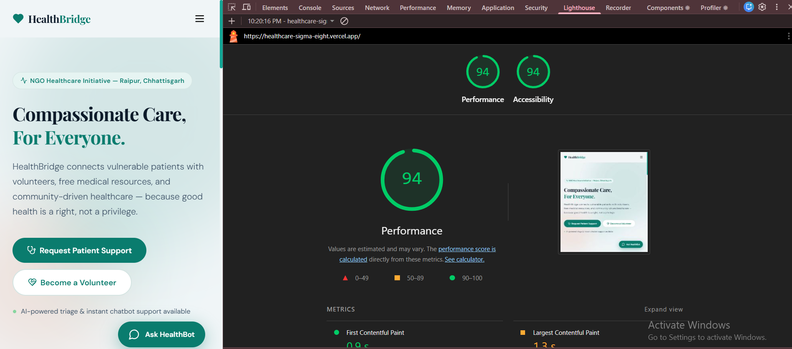

# HealthBridge NGO — Healthcare Support Platform

> A full-stack healthcare management system built for NGOs, featuring AI-powered patient triage, volunteer coordination, and a secure admin dashboard.

[](https://healthcare-sigma-eight.vercel.app)
[](https://healthcare-r6to.onrender.com/api-docs)
[](https://github.com/yochna)

---

## 🎯 What Problem Does This Solve?

Small NGOs managing healthcare support often rely on paper forms and manual tracking. HealthBridge digitizes this entire process — patients can register online, volunteers can sign up, and admins can manage everything from a secure dashboard without any technical knowledge.

---

## 🚀 Live Links

| | Link |
|---|---|
| 🌐 Frontend | https://healthcare-sigma-eight.vercel.app |
| 🔧 Backend | https://healthcare-r6to.onrender.com |
| 📡 API Docs | https://healthcare-r6to.onrender.com/api-docs |
| 💻 GitHub | https://github.com/yochna/Healthcare |

---

## ✨ Features

### 🌐 Public (No Login Required)
- **AI-Powered Triage** — Automatically classifies patient urgency (low/medium/high/critical) and generates a summary
- **Volunteer Registration** — Volunteers can sign up with skills and availability
- **Smart Auto-Reply** — Keyword-based auto-reply system for contact messages
- **FAQ Chatbot** — Instant answers to common healthcare questions

### 🔐 Admin Dashboard
- JWT authentication with refresh tokens
- View, filter, and paginate patients and volunteers
- Update patient status (pending → assigned → resolved)
- Approve/activate volunteers
- Delete records with confirmation modals
- URL-synced filters (bookmarkable and shareable)
- Skeleton loaders while data loads
- Toast notifications for all actions

---

## 🛠 Tech Stack

| Layer | Technology |
|---|---|
| Frontend | React, React Router v6, Axios |
| Backend | Node.js, Express.js |
| Database | MongoDB, Mongoose |
| Authentication | JWT + bcryptjs + Refresh Tokens |
| Security | Helmet, Rate Limiting, XSS Clean, Mongo Sanitize |
| API Docs | Swagger UI (OpenAPI 3.0) |
| Deployment | Vercel (frontend) + Render (backend) |

---

## 🏗 Architecture

```
Client (React)
    ↓ Axios Instance (with request/response interceptors)
Express Server
    ↓ Rate Limiter → CORS → Body Parser → Helmet
Auth Middleware (JWT verification)
    ↓
Service Layer (Business Logic + Validation)
    ↓
Mongoose Models
    ↓
MongoDB Atlas
```

---

## 📁 Folder Structure

```
healthcare-app/
├── client/                       → React frontend
│   └── src/
│       ├── api/
│       │   └── axiosInstance.js  → Axios + token refresh interceptor
│       ├── components/
│       │   ├── ConfirmModal.jsx  → Reusable confirmation modal
│       │   ├── ProtectedRoute.jsx→ Auth guard with intended redirect
│       │   └── ...
│       ├── hooks/
│       │   └── useForm.js        → Custom form hook
│       └── pages/
│           ├── Login.jsx         → Admin login with auth-bounce
│           ├── Patients.jsx      → Patient dashboard
│           ├── Volunteers.jsx    → Volunteer dashboard
│           └── Contacts.jsx      → Contact messages dashboard
│
└── server/                       → Express backend
    ├── config/
    │   ├── db.js                 → MongoDB connection
    │   └── swagger.js            → Swagger configuration
    ├── controllers/
    │   └── authController.js     → Login + refresh token logic
    ├── middleware/
    │   └── authMiddleware.js     → JWT verification + role guard
    ├── models/
    │   ├── Patient.js
    │   ├── Volunteer.js
    │   ├── Contact.js
    │   └── Admin.js
    ├── routes/
    │   ├── auth.js
    │   ├── patients.js
    │   ├── volunteers.js
    │   └── contacts.js
    ├── services/                 → Business logic layer
    │   ├── patientService.js
    │   ├── volunteerService.js
    │   └── contactService.js
    └── scripts/
        └── createAdmin.js        → One-time admin creation script
```

---

## ⚙️ Engineering Decisions

### 1. Service Layer Pattern
**Decision:** Created a dedicated `services/` folder — routes only handle HTTP, services handle logic.

**Why:** In production codebases, controllers that mix HTTP handling with business logic become impossible to test and maintain. By separating concerns, the validation logic, AI summary generation, and database operations live in services. If the database changes tomorrow, only services need updating — routes stay untouched. This is the standard pattern at companies like Uber and Airbnb.

---

### 2. Rate Limiting (Global + Strict Auth)
**Decision:** 100 requests/15min globally, 5 requests/15min on `/api/auth/login`.

**Why:** Without rate limiting, the login endpoint is wide open to brute force attacks — an attacker can programmatically try thousands of passwords per minute. The strict 5-attempt limit on login makes this practically impossible. The global limit protects against DDoS-style API abuse. This is a non-negotiable security requirement in any production system.

---

### 3. NoSQL Injection Prevention
**Decision:** Used `express-mongo-sanitize` to strip `$` and `.` from all request inputs.

**Why:** MongoDB is vulnerable to injection via JSON operators. Sending `{ "$gt": "" }` as a password value can bypass authentication entirely — the query becomes "find user where password is greater than empty string," which matches every user. Sanitizing inputs before they reach the database prevents this entire class of attack with zero performance cost.

---

### 4. JWT + Refresh Token Pattern
**Decision:** Short-lived access tokens (15 min) + long-lived refresh tokens (7 days) with automatic refresh via Axios interceptor.

**Why:** A stolen access token that never expires is a permanent security breach. Short-lived tokens limit the damage window to 15 minutes. The refresh token allows seamless re-authentication without forcing the admin to log in repeatedly. The Axios response interceptor handles this transparently — the admin never sees a session expiry. This is the exact pattern used by Google, GitHub, and Spotify.

---

### 5. URL-Synced Filters
**Decision:** Used React Router's `useSearchParams` to sync all dashboard filters with the URL.

**Why:** Tutorial-level dashboards store filters in React state — refreshing loses everything. By syncing with URL params (`?status=pending&urgency=high&page=2`), admins can bookmark a specific filtered view, share it with a colleague, and use the browser back button without losing context. This is standard in every professional dashboard (Jira, Linear, GitHub Issues).

---

### 6. Intended Redirect (Auth-Bounce)
**Decision:** When an unauthenticated user tries to access `/admin/patients`, they are redirected to login and then automatically returned to `/admin/patients` after logging in.

**Why:** Simply redirecting all users to the dashboard homepage after login ignores their original intent. Storing the intended path in React Router's `location.state` and redirecting back after login is a small detail that separates amateur from professional UX.

---

## 📡 API Documentation

Full interactive Swagger docs:
**👉 https://healthcare-r6to.onrender.com/api-docs**

### Key Endpoints

| Method | Endpoint | Access | Description |
|---|---|---|---|
| POST | /api/auth/login | Public | Admin login |
| POST | /api/auth/refresh | Public | Refresh access token |
| POST | /api/patients | Public | Register patient |
| GET | /api/patients | Admin | Get all patients (paginated + filtered) |
| PUT | /api/patients/:id | Admin | Update patient status/urgency |
| DELETE | /api/patients/:id | Admin | Delete patient |
| POST | /api/volunteers | Public | Register volunteer |
| GET | /api/volunteers | Admin | Get all volunteers (paginated + filtered) |
| PUT | /api/volunteers/:id | Admin | Update volunteer status |
| DELETE | /api/volunteers/:id | Admin | Delete volunteer |
| POST | /api/contacts | Public | Submit contact message |
| GET | /api/contacts | Admin | Get all messages (paginated) |
| DELETE | /api/contacts/:id | Admin | Delete message |

---

## 🔒 Security Implementation

| Security Layer | Tool | Purpose |
|---|---|---|
| Secure HTTP Headers | Helmet.js | Prevents clickjacking, XSS, sniffing |
| Rate Limiting | express-rate-limit | Prevents brute force + DDoS |
| NoSQL Injection | express-mongo-sanitize | Strips MongoDB operators from input |
| XSS Protection | xss-clean | Strips HTML tags from input |
| Password Hashing | bcryptjs (10 rounds) | Prevents plain-text password storage |
| Auth Tokens | JWT (15m access + 7d refresh) | Secure stateless authentication |
| Request Size | express.json({ limit: "10kb" }) | Prevents payload attacks |
| CORS | cors (production origin) | Restricts API to known frontend |


## 📊 Lighthouse Scores



| Metric | Score |
|---|---|
| Performance | 98 ✅ |
| Accessibility | 94 ✅ |
---

## 🚀 Running Locally

### Prerequisites
- Node.js v18+
- MongoDB Atlas account

### Backend Setup
```bash
cd server
npm install

# Create .env file
MONGO_URI=your_mongodb_connection_string
PORT=5000
JWT_SECRET=your_jwt_secret
REFRESH_SECRET=your_refresh_secret
NODE_ENV=development
CLIENT_URL=http://localhost:3000

# Create admin account
node scripts/createAdmin.js

# Start server
node index.js
```

### Frontend Setup
```bash
cd client
npm install

# Create .env file
REACT_APP_API_URL=http://localhost:5000
CI=false

# Start app
npm start
```

---

GitHub: https://github.com/yochna